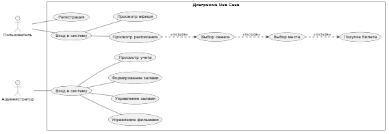
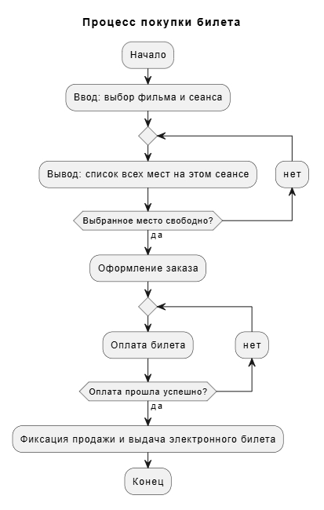

# Лабораторная работа №2

**Выполнил:** Хаитов Михаил  
**Проект:** Учет продажи билетов в кинотеатр

# Описание
Проект предназначен для автоматизации продажи билетов, оптимизации расписания и цифрового учета выручки кинотеатра. 

## Цели и стек технологий
* **Цель:** отказ от бумажного учета, обеспечение онлайн-доступности афиши и учет статистики продаж.
* **Стек:** Язык программирования **Python**

## Основные роли и функции
1. **Администратор (Сотрудник):**
   * Управление базой фильмов и залов (ряды, места).
   * Формирование расписания сеансов.
   * Контроль кассовых операций и просмотр отчетов о выручке.
2. **Пользователь (Зритель):**
   * Регистрация и вход в систему.
   * Просмотр афиши и детального расписания.
   * Интерактивный выбор мест и покупка электронного билета.

## Диаграмма Use Case
Реализовано с помощью PlantUML:

## Блок схема (1). Процесс покупки билета
Реализовано с помощью PlantUML:

## Блок схема (2). Регастрация пользователя
Реализовано с помощью PlantUML:

(docs/blok-cxema2.png)
